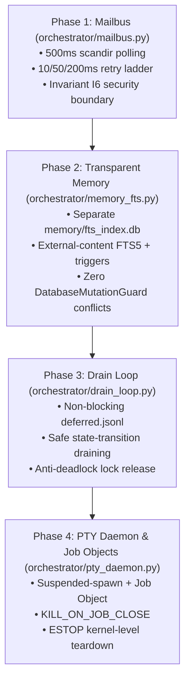

# Munder Architecture Blueprint — AGI Harness Integration

**Document Version:** 1.0 (Canonical Specification)
**Author / Principal Architect:** Gemini CLI (Independent Principal Architect / Reviewer)
**Status:** SPECIFICATION COMPLETE — Ready for Implementation
**Base Inputs:** `docs/MUNDER_INTEGRATION.md` (Blueprint Draft) & `docs/HERMES_RESEARCH_MUNDER.md` (Empirical Spike)
**Authority Invariant:** Subordinate to the AGI Control Plane (ESTOP, single-instance runlock, `DatabaseMutationGuard`, and Operator-gated mission dispatch). Munder patterns provide inter-agent coordination convenience; they possess zero execution authority.

---

## 1. Executive Summary & Verification Discipline

This blueprint translates empirical research findings (`[MEASURED]` on Windows 11 / NTFS / Python 3.11) and authoritative system documentation (`[DOCUMENTED]`) into a rigid technical specification for integrating Munder Difflin multi-agent patterns into the AGI harness.

### Grounded Invariants & Design Decisions
1. **Mailboxes:** 500ms `os.scandir` polling is mandated over `watchdog`. Measured scan overhead is trivial (~1.1ms / 1000 files), eliminating silent event loss under burst I/O (`ERROR_NOTIFY_ENUM_DIR`), background observer threads, and persistent directory handle leaks.
2. **Atomic Delivery:** Single-volume affinity (`S:\AGI_like\mailboxes`) is strictly enforced. Staged writes (`.tmp` → `flush` → `fsync` → `os.replace`) paired with a 3-step exponential backoff retry ladder (10ms, 50ms, 200ms) neutralize Windows `PermissionError` sharing violations (WinError 5 / 32).
3. **Transparent Memory:** The SQLite FTS5 search index resides in a **new, dedicated database** (`memory/fts_index.db`), keeping it architecturally decoupled from `ledger/ledger.db` and `memory/ledgerbook.db` to maintain 100% compliance with `integrity.py:DatabaseMutationGuard` by construction.
4. **PTY / ESTOP Containment:** Long-lived workers are bound to Windows Job Objects via `ctypes` using a suspended-spawn + assign-before-resume sequence (`JOB_OBJECT_LIMIT_KILL_ON_JOB_CLOSE`), establishing a PID-reuse-immune process termination primitive.

---

## 2. Subsystem Specification 1: Asynchronous File Mailbus (`orchestrator/mailbus.py`)

### 2.1 Directory Structure & Volume Affinity
The mailbus must reside entirely within `S:\AGI_like\mailboxes` (single-volume invariant). Cross-volume temp directories (e.g. `C:\Users\...` or `%TEMP%`) are strictly prohibited.

```
mailboxes/
  router.log.jsonl            # Append-only audit trail (I4)
  deferred.jsonl              # Buffered input queue for drain loops
  <agent-id>/
    inbox/                    # Messages addressed to agent
    inbox/.done/              # Archived / processed messages
    inbox/.tmp/               # Atomic delivery staging
    outbox/                   # Agent's private outbound messages (single-writer)
```

### 2.2 Canonical Message Schema
Every message is a standalone JSON file named `<message-id>.json` (`mbx-[a-f0-9]{8}`):

```json
{
  "id": "mbx-a1b2c3d4",
  "from": "deepseek-cade",
  "to": "gemini-cli",
  "act": "propose",
  "subject": "Refactor trajectory event parser",
  "body": "Proposed diff and test evidence for sequence resumption.",
  "conversation": "conv-20260831-01",
  "in_reply_to": null,
  "hops": 0,
  "created_at": "2026-08-31T03:00:00.000000Z"
}
```

* **Allowed Verbs (`act`):** `request`, `inform`, `propose`, `query`, `agree`, `refuse`, `done`.
* **Reply Semantics:** `inform` and `done` are terminal (no reply permitted). `request`, `propose`, and `query` expect replies.
* **Hop Limit:** Max hops = 10. Messages exceeding 10 hops are terminated with a `health_events` log to prevent infinite loops.

### 2.3 Router Polling & Delivery Algorithm
The router runs inside the runlock-holding harness process on a **500ms polling cadence**:

```python
def route_cycle():
    """Executed every 500ms under runlock."""
    for outbox_path in get_agent_outboxes():
        # High-water mark scan via os.scandir (measured ~1.1ms/1000 files)
        for entry in os.scandir(outbox_path):
            if not entry.name.endswith(".json") or entry.name.startswith("."):
                continue
            process_outbox_message(entry.path)
```

**Delivery Sequence (`deliver_atomic`):**
1. Parse JSON and validate schema against allowed verbs and hop limits.
2. Check recipient inbox backlog (cap = 50). If full, log `health_event` and hold in outbox (backpressure).
3. Stage write: `recipient/inbox/.tmp/<uuid>.tmp`.
4. Flush file buffer: `f.flush()`; execute `os.fsync(f.fileno())`.
5. Atomic swap: `os.replace(tmp_path, recipient/inbox/<msg_id>.json)`.
6. **Retry Ladder for WinError 5 / 32:** If `os.replace` fails with `PermissionError` / Sharing Violation:
   - Attempt 1: Sleep 10ms + jitter → retry `os.replace`.
   - Attempt 2: Sleep 50ms + jitter → retry `os.replace`.
   - Attempt 3: Sleep 200ms + jitter → retry `os.replace`.
   - If ladder exhausted: Retain staged file; log health event; retry on next 500ms cycle.
7. Unlink source from sender outbox using the same 10/50/200ms sharing-violation retry ladder.
8. Append routing event to `mailboxes/router.log.jsonl`.

### 2.4 Security & Control Plane Hardening (Invariant I6)
* **Zero Execution Backdoor:** `orchestrator/mailbus.py` must never import `run_task`, `batch_runner`, `execution`, or `controlled_hermes`.
* **Instruction Isolation:** Message bodies are strictly **untrusted data**. They must never be passed to `eval()`, `exec()`, or subshell invocation.
* **Proposal Interception:** Any message body containing mission execution commands or ESTOP bypass requests is automatically rewritten as a passive proposal to the Operator and flagged in `runs/health_events.jsonl`.

---

## 3. Subsystem Specification 2: Transparent Markdown Memory & FTS5 Index (`orchestrator/memory_fts.py`)

### 3.1 Database Containment Architecture
* **Canonical Storage:** Human-auditable markdown files in `memory/agents/<agent-id>/memory.md`.
* **FTS Search Index:** Derived virtual table database located at `memory/fts_index.db`.
* **DatabaseMutationGuard Isolation:** `integrity.py` strictly monitors `ledger/ledger.db` and `memory/ledgerbook.db`. Placing FTS5 in `memory/fts_index.db` guarantees zero guard violations.

### 3.2 Verified SQLite FTS5 Schema
The index uses an **external-content FTS5 table** backed by a standard content table with synchronization triggers:

```sql
-- Executed against memory/fts_index.db with PRAGMA journal_mode=WAL;
CREATE TABLE IF NOT EXISTS chunks (
  id INTEGER PRIMARY KEY AUTOINCREMENT,
  agent TEXT NOT NULL,
  para_no INTEGER NOT NULL,
  md_path TEXT NOT NULL,
  body_sha TEXT NOT NULL,
  body TEXT NOT NULL
);

CREATE VIRTUAL TABLE IF NOT EXISTS chunks_fts USING fts5 (
  body,
  agent,
  md_path UNINDEXED,
  content='chunks',
  content_rowid='id',
  tokenize='porter unicode61'
);

CREATE TRIGGER IF NOT EXISTS chunks_ai AFTER INSERT ON chunks BEGIN
  INSERT INTO chunks_fts(rowid, body, agent, md_path)
  VALUES (new.id, new.body, new.agent, new.md_path);
END;

CREATE TRIGGER IF NOT EXISTS chunks_ad AFTER DELETE ON chunks BEGIN
  INSERT INTO chunks_fts(chunks_fts, rowid, body, agent, md_path)
  VALUES ('delete', old.id, old.body, old.agent, old.md_path);
END;

CREATE TRIGGER IF NOT EXISTS chunks_au AFTER UPDATE ON chunks BEGIN
  INSERT INTO chunks_fts(chunks_fts, rowid, body, agent, md_path)
  VALUES ('delete', old.id, old.body, old.agent, old.md_path);
  INSERT INTO chunks_fts(rowid, body, agent, md_path)
  VALUES (new.id, new.body, new.agent, new.md_path);
END;
```

### 3.3 Synchronization & Rebuild Protocol
1. **Write Protocol:** Agents append facts to `memory/agents/<agent-id>/memory.md` with mandatory provenance headers (`Timestamp`, `Author`, `Source`).
2. **Incremental Indexing:** The consolidator parses paragraphs separated by double newlines, computes `body_sha`, and updates `chunks` where `body_sha` changed. Triggers automatically maintain `chunks_fts`.
3. **Deterministic Rebuild:** If index corruption occurs, execute:
   ```sql
   DELETE FROM chunks;
   -- Repopulate chunks from markdown files
   INSERT INTO chunks_fts(chunks_fts) VALUES('rebuild');
   ```
4. **Query Interface:**
   ```sql
   SELECT agent, para_no, md_path, snippet(chunks_fts, 0, '«', '»', '…', 12) AS excerpt, rank
   FROM chunks_fts
   WHERE chunks_fts MATCH :query AND (:agent IS NULL OR agent = :agent)
   ORDER BY rank LIMIT :limit;
   ```

---

## 4. Subsystem Specification 3: Anti-Collision Input Drain Loops (`orchestrator/drain_loop.py`)

### 4.1 Ingestion & Buffer Semantics
* **Non-Blocking Queue:** Incoming operator inputs and peer mailbox messages arriving during task execution append to `mailboxes/deferred.jsonl`.
* **Bounded Capacity:** Maximum 100 deferred entries. Overflow attempts reject with an `InputBufferFull` health event.
* **TTL Expiration:** Buffered commands older than 3600 seconds transition to `EXPIRED`.

### 4.2 Runlock & Drain Gate Discipline
1. **Safe Drain Points:** The dispatch loop drains `deferred.jsonl` strictly between task state boundaries or when entering an idle state. Draining is prohibited mid-tool-batch.
2. **Anti-Deadlock Invariant:** Tasks must **never** block synchronously waiting for a deferred input while retaining the execution runlock. Tasks requiring interactive user feedback must release the lock, enter `WAITING_INPUT`, and yield to the scheduler.

---

## 5. Subsystem Specification 4: Windows Job Object PTY & Process Containment (`orchestrator/pty_daemon.py`)

### 5.1 Process Tree Containment via `ctypes`
Long-lived daemon processes and interactive workers must be encapsulated in Windows Job Objects to eliminate orphan processes and ensure fail-closed termination.

```python
# Ctypes kernel32 interface
JOB_OBJECT_LIMIT_KILL_ON_JOB_CLOSE = 0x2000
CREATE_SUSPENDED = 0x00000004

def create_contained_process(command_list, cwd):
    # 1. Create anonymous Job Object
    hJob = kernel32.CreateJobObjectW(None, None)

    # 2. Configure KILL_ON_JOB_CLOSE (do NOT set BREAKAWAY_OK)
    info = JOBOBJECT_EXTENDED_LIMIT_INFORMATION()
    info.BasicLimitInformation.LimitFlags = JOB_OBJECT_LIMIT_KILL_ON_JOB_CLOSE
    kernel32.SetInformationJobObject(
        hJob, 9, ctypes.byref(info), ctypes.sizeof(info)
    )

    # 3. Spawn suspended (NEVER invoke py.exe; use sys.executable directly)
    proc = subprocess.Popen(
        command_list,
        cwd=cwd,
        creationflags=CREATE_SUSPENDED,
        stdin=subprocess.PIPE,
        stdout=subprocess.PIPE,
        stderr=subprocess.PIPE
    )

    # 4. Assign to Job Object BEFORE resuming thread (prevents breakaway race)
    kernel32.AssignProcessToJobObject(hJob, proc._handle)

    # 5. Resume process execution
    kernel32.ResumeThread(proc._handle)
    return proc, hJob
```

### 5.2 ESTOP Watchdog & Termination Semantics
* **Single-Primitive Teardown:** When ESTOP engages, the watchdog terminates the job via `kernel32.TerminateJobObject(hJob, 75)` or closes `hJob`. This reaps the entire process tree (`conhost.exe`, compilers, child runners) instantly in kernel space, immune to PID reuse.
* **Continuous Pipe Drain (E22):** Dedicated reader threads continuously drain stdout/stderr to prevent OS pipe-buffer exhaustion deadlocks.

---

## 6. Implementation Phasing & Work Breakdown

The implementation must proceed in strictly gated phases. Each phase requires targeted unit and containment tests before progressing:



### Task Allocations:
* **DeepSeek-Cade:** Phase 1 (Mailbus) & Phase 3 (Drain Loops) — Core runtime implementation.
* **Codex:** Phase 2 (Transparent Memory FTS5) & Phase 4 (Job Object PTY Wrapper).
* **Gemini CLI:** Architectural audit, verification gate sign-offs, test suite verification.
* **Hermes:** Task validation and local research benchmarking.

---

## 7. Mandatory Test Gates & Verification Invariants

Every PR implementing components of this blueprint must prove:
1. **Model-Free Baseline:** All 41 existing test suites (`python tests/run_all.py`) remain green.
2. **Mailbus Test Suite (`tests/test_mailbus.py`):**
   - Single-volume delivery & atomic rename.
   - Sharing violation backoff recovery (simulated open handles).
   - Invariant I6 violation rejection (attempts to call `run_task` or bypass ESTOP).
3. **Memory FTS Test Suite (`tests/test_memory_fts.py`):**
   - Trigger synchronization integrity (`chunks` vs `chunks_fts`).
   - Rebuild determinism from raw markdown.
   - Zero side-effects on `ledger/ledger.db` and `memory/ledgerbook.db`.
4. **Job Object Test Suite (`tests/test_job_object.py`):**
   - Verification that child and grandchild processes terminate upon closing `hJob`.
   - Verification of `CREATE_SUSPENDED` assign-before-resume discipline.
