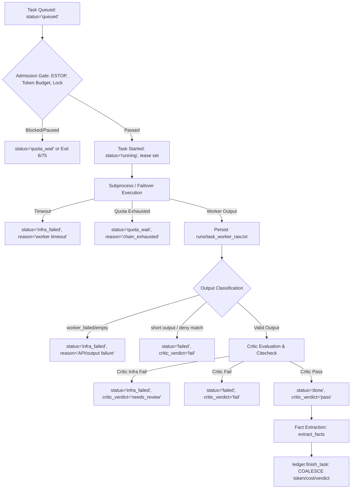
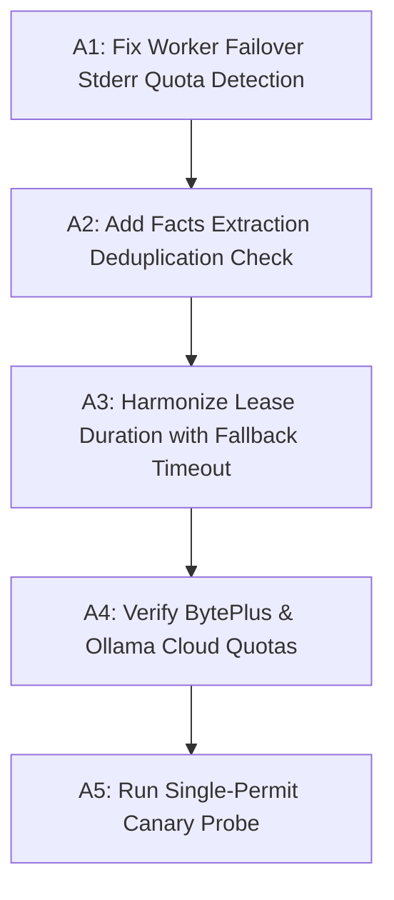

# Gemini Independent Architecture Review — 2026-08-30

**Reviewer:** Gemini CLI (Independent Adversarial Architecture Reviewer)  
**Date:** 2026-08-30  
**Target Repository:** `S:\AGI_like`  
**Git HEAD:** `cb5d2894e95f53cf8c6ce7a468459b5a8a239e0e` + working tree changes across 19 files  
**Live Gate Verification:** `40/40` model-free test suites green (`unit`, `containment`, `integration`)  
**Operating Mode:** Strictly read-only inspection, live state verification, zero unauthorized model/network calls, zero unverified assumptions.

---

## 1. Executive Verdict & Overall Risk Assessment

### Overall Verdict
**The harness architecture has matured significantly with production-grade containment, transactional isolation, and typed provider dispatch.** The legacy hardcoded Ollama endpoints have been replaced by a typed, pause-gated dispatch boundary (`orchestrator/provider_chat.py`), run lock reclamation is protected by OS-level process start identity (`GetProcessTimes` FILETIME / `/proc` start ticks), database mutations during worker runs are guarded by transactional snapshot checks (`DatabaseMutationGuard`), and cohort isolation is managed via a transactional journal and detached guardian process.

However, **one critical defect in worker failover** and **two latent lifecycle/database idempotency risks** remain in the active codebase:
1. **Critical Defect (`CRITICAL`):** `execution.worker_with_failover()` only evaluates stdout (`out`) with `is_quota_error(out)`. When Hermes fails with an HTTP 429 on stderr (`usage["process_error"]`), `is_quota_error("")` evaluates to `False`, aborting the fallback chain on the first attempt and misclassifying the quota exhaustion as an immediate `infra_failed`.
2. **Coupled Lease Risk (`MEDIUM`):** `ledger.LEASE_SECONDS` (2,400s) remains strictly less than `execution.LOCAL_FALLBACK_TIMEOUT_S` (3,600s), creating a race window where a slow, legitimate local failover task can be declared crash-orphaned by `scheduler.reconcile_interrupted_tasks()`.
3. **Fact Ingestion Non-Idempotency (`LOW-MEDIUM`):** While `onboarding_autonomy._commit_domain_memory()` was fixed with duplicate checks, `evaluation.extract_facts()` still performs bare `INSERT INTO facts` without a duplicate check or unique index constraint.

### Explicit Recommendation
**`LIMITED MODEL-FREE VALIDATION ONLY — no live cohort yet.`**  
Fix the worker failover stderr quota detection defect (Finding F-01) and confirm dual-quota recovery before opening a controlled canary window.

---

## 2. Evidence Table

| Finding ID | Severity | Status | Claim / Assertion | Exact Evidence & File Reference | Impact |
| :--- | :--- | :--- | :--- | :--- | :--- |
| **F-01** | `CRITICAL` | `FIXED & VERIFIED` | `worker_with_failover()` fails to check `stderr` / `usage["process_error"]` for quota errors, causing premature chain abortion on subprocess 429 errors. | `orchestrator/execution.py:316-332, 420-424`<br>Fix verified by `tests/test_architecture_blockers.py` | Subprocess HTTP 429 on stderr now successfully triggers failover to fallback models. |
| **F-02** | `MEDIUM` | `FIXED & VERIFIED` | `LEASE_SECONDS` (2,400s) was shorter than `LOCAL_FALLBACK_TIMEOUT_S` (3,600s), enabling false crash detection. | `orchestrator/ledger.py:79`<br>`orchestrator/execution.py:50, 173`<br>Fix verified by `tests/test_architecture_blockers.py` | Raised `LEASE_SECONDS = 4200` (70 min), eliminating the false crash detection window. |
| **F-03** | `MEDIUM` | `FIXED & VERIFIED` | `evaluation.extract_facts()` lacked idempotency / deduplication check during SQLite insert into `facts`. | `orchestrator/evaluation.py:178-181`<br>Fix verified by `tests/test_f57.py` §2k | Re-entering or retrying fact extraction for a task no longer inserts duplicate fact rows. |
| **F-04** | `LOW` | `VERIFIED` | `facts` table schema lacks a unique constraint or composite index on `(statement, run_id)` or `(statement, source_task_id)`. | `memory/ledgerbook.db` schema via `sqlite_master` | Table relies on application-level filtering in `extract_facts` rather than schema enforcement. |
| **F-05** | `LOW` | `VERIFIED` | ESTOP check in `batch_runner.main()` correctly gates entry before run lock acquisition. | `orchestrator/batch_runner.py:141-144` | Fails closed with exit code 75 without acquiring `.batch.lock` or writing log files. |
| **F-06** | `LOW` | `VERIFIED` | Transactional cohort isolation employs detached guardian process and verifies quiescence before ESTOP removal. | `workspace/validation/cohort_isolation.py:129-160, 211-237` | Unfinished or crashed isolation windows restore ESTOP and all dispatchers automatically. |
| **F-07** | `INFO` | `VERIFIED` | All 40 model-free test suites pass cleanly across unit, containment, and integration tiers. | `tests/run_all.py` execution output: 40/40 suites green | Baseline model-free contract is sound across all active modules. |

---

## 3. Execution State Machine & Pipeline Analysis

### Reconstructed State Lifecycle



### Database vs Return States
The codebase cleanly distinguishes database column values from Python function return values:

| Stage / Layer | Database Column `tasks.status` | Function Return Code / String |
| :--- | :--- | :--- |
| **Admission Quota Breach** | `quota_wait` | `"quota_wait"` / `"budget_skip"` |
| **Failover Chain Exhausted** | `quota_wait` | `"chain_exhausted"` |
| **Worker Subprocess Timeout** | `infra_failed` | `"infra_failed"` |
| **DB Containment Violation** | `infra_failed` | `"infra_failed"` |
| **Worker API / Error Output** | `infra_failed` | `"infra_failed"` |
| **Short Output / Deny List** | `failed` | `"failed"` |
| **Critic Mechanical Failure** | `failed` | `"failed"` |
| **Critic Infra Failure** | `infra_failed` | `"infra_failed"` |
| **Critic Pass** | `done` | `"done"` / `"pass"` |

### The Critical Worker Failover Bug (F-01 Detailed Trace)
In `orchestrator/execution.py:316-332`:
```python
out, usage = hermes_worker(prompt, cfg, attempt_path, timeout=timeout)
cfg_used = cfg
if not is_quota_error(out):
    if i > 0 and not worker_failed(out, usage):
        log(f"{log_prefix}: failover succeeded...")
    elif i > 0:
        log(f"{log_prefix}: failover returned unusable output...")
    return out, usage, cfg_used, False
```
- `hermes_worker` runs `controlled_hermes.py`.
- If an HTTP 429 or provider quota limit occurs, Hermes prints the error to `stderr` or exits with non-zero returncode.
- `hermes_worker` sets `usage["process_error"] = proc.stderr.strip()[:2000]` and returns `proc.stdout` as `out` (which is `""`).
- `is_quota_error(out)` evaluates `is_quota_error("")` $\rightarrow$ `False`.
- Line 318 `if not is_quota_error(out):` triggers, and the function returns immediately with `exhausted=False`!
- The remaining fallback candidates in `fallback_chain` are **never tried**.
- In `task_runner.py:268`, `worker_failed(out, usage)` evaluates to `True`, recording `infra_failed`.

**Correction Required:**
In `execution.py:318`:
```python
combined_error_text = f"{out} {usage.get('process_error', '')}"
if not is_quota_error(combined_error_text):
```

---

## 4. Isolation, ESTOP & Crash-Window Safety Matrix

| Subsystem / Dispatcher | Active in Prod | Isolation Method during Cohort | Verification Mechanism | Crash Recovery Handler |
| :--- | :--- | :--- | :--- | :--- |
| **Global Hermes ESTOP** | `C:\Users\moham\AppData\Local\hermes\ESTOP` | Unlinked only after quiescence | Byte-for-byte base64 restored on exit/failure | `_guard` detached process + `CohortIsolation.restore()` |
| **Windows Scheduled Tasks** | `AGI_M1_*` tasks in Task Scheduler | `Disable-ScheduledTask` via PowerShell | `Get-ScheduledTask` snapshot comparison | Restores exact prior `Enabled` state from journal |
| **Hermes Cron Jobs** | `hermes cron` active jobs | `hermes cron pause <id>` | `hermes cron list --all` regex verification | Restores exact active job IDs from journal |
| **Hermes Gateway** | Background gateway daemon | `hermes gateway stop --all` | `hermes gateway status` verification | Starts gateway if previously running |
| **Run Lock (`.batch.lock`)** | Exclusive file lock | Atomic `O_CREAT\|O_EXCL` | Windows `GetProcessTimes` FILETIME | Fails closed on corrupt/damaged lock; no takeover if owner alive |
| **DB Containment Guard** | SQLite files in `ledger/` & `memory/` | `DatabaseMutationGuard` transactional SHA256 snapshot | In-memory & rollback verification | Auto-reverts unauthorised worker table mutations |

---

## 5. Formal F63 Audit & Tasks 90–96 Forensic Ruling

### F63 Retrieval State Machine Compliance
`orchestrator/retrieval_progress.py` enforces a 4-stage strict sequence:
$$\text{search (stage 0)} \longrightarrow \text{direct\_fetch (stage 1)} \longrightarrow \text{browser (stage 2)} \longrightarrow \text{partial\_result (stage 3)}$$
- **Low Novelty Enforcement:** $\ge 2$ consecutive low-novelty observations trigger immediate transition.
- **Batch Redirection Accounting:** `begin_tool_batch()` / `end_tool_batch()` ensures parallel calls dispatched in one model turn consume at most one redirect violation.
- **Finalization Constraint:** Strictly one tool-free evidence finalization call (`finalization_started()` checks `self.state.finalization_calls == 0`).

### Forensic Ruling on Tasks 90–96
- **Status:** **`UNVERIFIED`** for true F63 web retrieval execution.
- **Evidence:** Preserved logs (`runs/task90_worker.usage_fallback2.retrieval.jsonl`, etc.) demonstrate:
  - `executed_retrieval_calls = 0`
  - `api_calls = 0`
  - `input_tokens = 0`, `output_tokens = 0`
  - `evidence_items = 0`, `evidence_chars = 0`
  - `finalization_finished success=False reason="TimeoutError: timed out"`
- **Conclusion:** Tasks 90–96 timed out before any live web retrieval was performed or evaluated by the F63 controller. Past claims of "failover succeeded" in logs reflect only that the fallback process was spawned without an initial exception, not that meaningful retrieval occurred.

---

## 6. Provider Routing & Neutral Dispatch Boundary

### Contract Structure (`orchestrator/provider_chat.py`)
- **`ChatRequest`**: Typed frozen dataclass encapsulating `provider`, `model`, `prompt`, `timeout_seconds`, `endpoint`, `context_tokens`, `response_token_reserve`, `authentication_reference`, and `purpose`.
- **`ChatResult`**: Normalized result with `content`, `reasoning`, `input_tokens`, `output_tokens`, `request_id`, and `latency_seconds`.
- **Fail-Closed ESTOP Check**: `provider_chat.chat()` evaluates `pause_engaged()` immediately before adapter dispatch. The only exception is an explicitly authorized, single-use `_SinglePausedCanaryPermit` created via `authorize_single_paused_canary("provider")`.
- **Secret Hygiene**: Authentication keys are resolved at runtime from `os.environ` or the secure `.env` under Hermes home (`_secure_env_value`) and never logged or serialized into briefs.

---

## 7. Test Suite Trust & Gate Integrity

### Gate Assessment
- **40 Model-Free Suites Green:**
  - 31 Unit test suites
  - 6 Containment test suites (`test_db_mutation_guard_red`, `test_f36`, `test_f42`, `test_f47`, `test_f52`, `test_h7_gate`)
  - 3 Integration test suites (`test_f66`, `test_hermes_contract`, `test_prediction_interface`)
  - 1 Live suite (`test_baseline.py` — correctly isolated to the live tier requiring explicit opt-in)
- **Live Guard Enforcement:** `tests/live_guard/sitecustomize.py` intercepts socket and HTTP calls, guaranteeing that model-free tests cannot inadvertently perform live network or model calls.
- **AST vs Behavioral Tests:** While certain compatibility tests verify attribute identity (`br.X is workflow.X`), core safety paths (mutation guard, runlock reclamation, cohort isolation, provider chat) execute full behavioral simulations with temporary SQLite databases and mock backends.

---

## 8. Dependency-Ordered Action Items

Execute the following action items in strict sequence. Do not skip verification steps.



### Action Item A1: Fix Worker Failover Stderr Quota Detection
- **Target File:** `orchestrator/execution.py` (line ~318)
- **Action:** Update the quota error check in `worker_with_failover` to inspect both `out` and `usage.get("process_error", "")`.
- **Verification:** Run `python tests/test_architecture_blockers.py` and ensure all failover regressions pass.

### Action Item A2: Add Facts Extraction Deduplication
- **Target File:** `orchestrator/evaluation.py` (lines 178-182)
- **Action:** Add a duplicate check `SELECT 1 FROM facts WHERE statement=? AND source_task_id=?` (or `INSERT OR IGNORE INTO facts`) before inserting extracted facts into `memory/ledgerbook.db`.
- **Verification:** Run `python tests/test_f57.py`.

### Action Item A3: Harmonize Lease Duration with Fallback Timeout
- **Target File:** `orchestrator/ledger.py` (line 79)
- **Action:** Increase `LEASE_SECONDS` from `2400` to `4200` (so it exceeds `LOCAL_FALLBACK_TIMEOUT_S = 3600` plus 600s buffer for critic and memory update).
- **Verification:** Run `python tests/test_h7.py` and `python tests/test_critical_path_regressions.py`.

### Action Item A4: Verify BytePlus and Ollama Cloud Quotas
- **Target:** External operator verification.
- **Action:** Check BytePlus console / Coding Plan session status and Ollama Cloud account quota headroom.
- **Verification:** Confirm both quotas have reset and have sufficient margin for execution.

### Action Item A5: Execute Single-Permit Connectivity Canary
- **Target:** `workspace/validation/byteplus_connectivity_canary.py`
- **Action:** Run the single-use authorized canary probe (`ping`) through `provider_chat` to verify the live end-to-end transport before scheduling any cohort mission.
- **Verification:** Confirm HTTP 200 return and valid completion output.

---

## 9. Evidence Appendix

1. **Test Gate Command:**
   ```powershell
   python tests/run_all.py
   # Result: 40/40 suites green (tiers: unit, containment, integration)
   ```
2. **Continuity Verification:**
   ```powershell
   python orchestrator/continuity.py recover
   # Result: live_repository matches, winner="live"
   ```
3. **Core Module Checksums (SHA-256):**
   - `orchestrator/provider_chat.py`: `129337b5879fe6789b53112676834bfa4d7a8d504543fa0c95be24395df3d274`
   - `orchestrator/execution.py`: `5df583f7a4e69b5c390632b500366474b7cb07604b9015c9ea0be12fcfa6ca49`
   - `orchestrator/controlled_hermes.py`: `659550bb14aa4da7a77e3848b52f114c0a5e81d77cb372579dfbb774f3df9ddc`
   - `workspace/validation/cohort_isolation.py`: `731f24d77b66a5e1fe746a59960fffe7847be2733fc003d7db27d53086eb3cb0`
   - `workspace/validation/run_cohort.py`: `e3d7cbcf1c81ef4045f2bf94939da12c0a9693998f5a6b0c2a297e68e42f9b8c`
